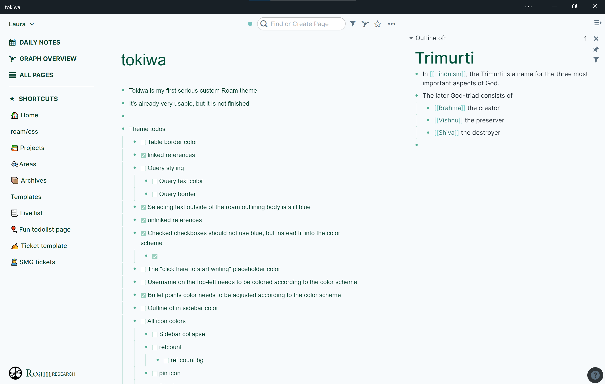

# tokiwa-roam-theme

A serene theme for Roam Research

This is my first theme for Roam, inspired by [the existing Tokiwa Hugo theme](https://github.com/heyeshuang/hugo-theme-tokiwa)



## Installation

If you haven't aready, create a page named `roam/css`

Paste in the theme into a ```css``` textbox
The theme should now be applied

For more information on customizing Roam with themes and css, check out this nesslabs guide: https://nesslabs.com/roam-research-themes-custom-styling-css
